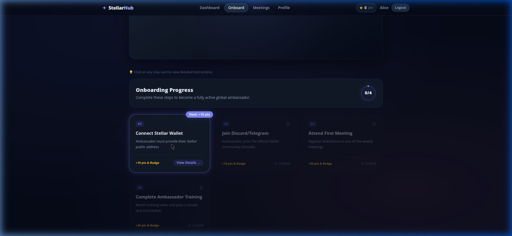
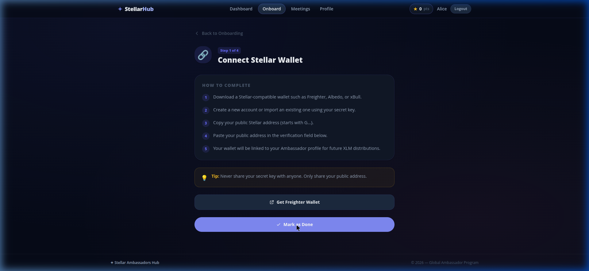
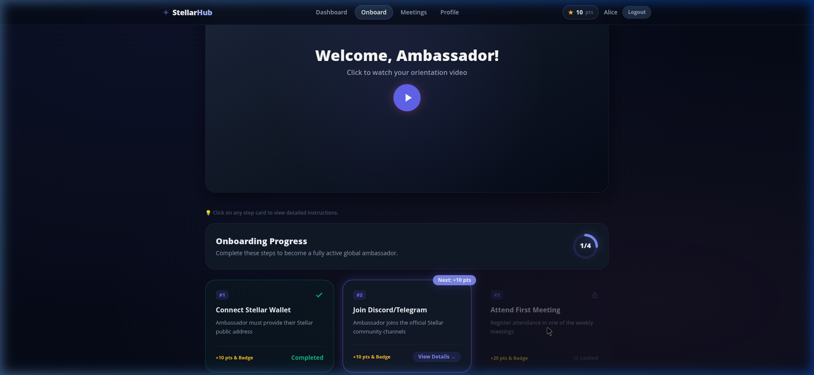
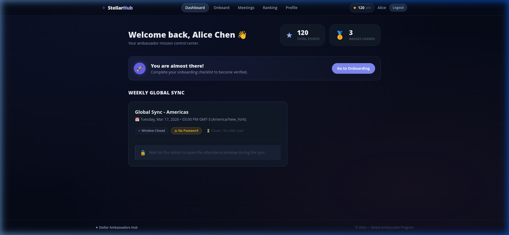
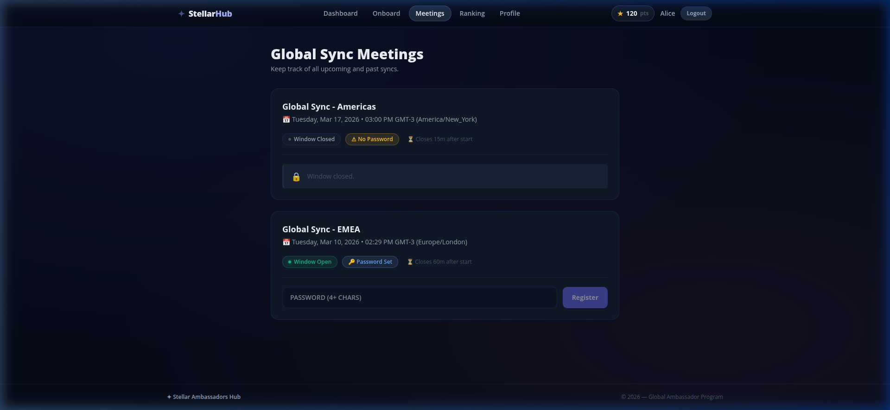
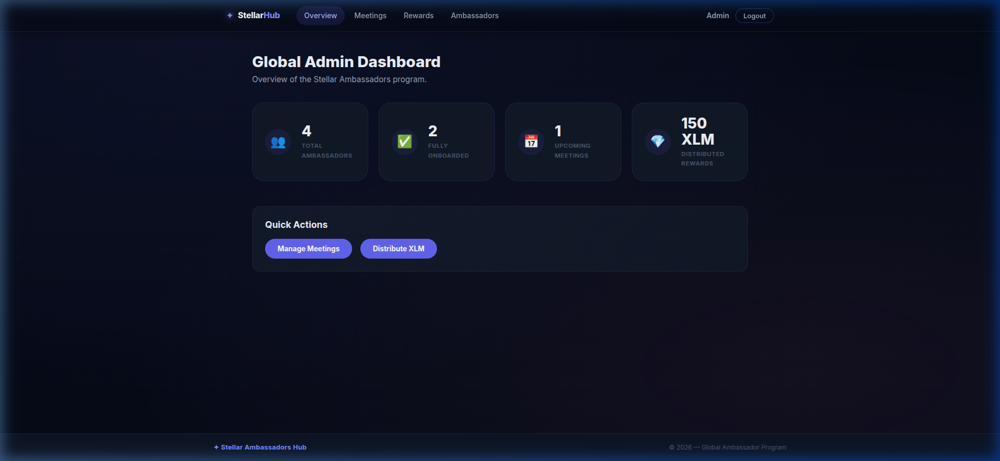
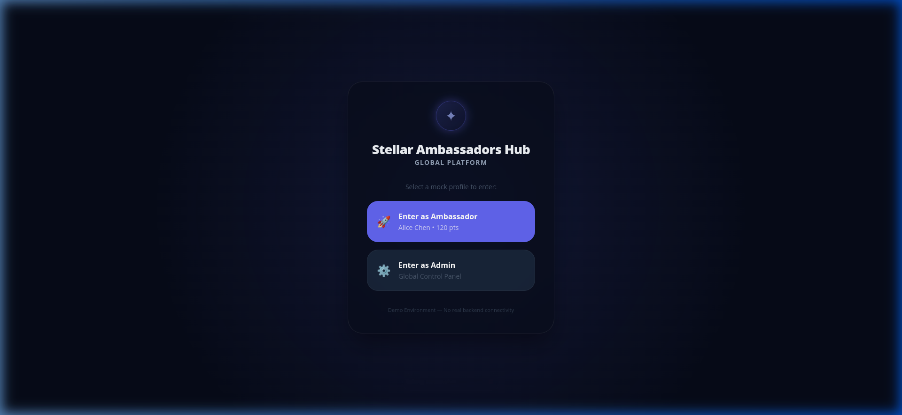

# Stellar Ambassadors Hub

A full-featured React application for managing the Stellar Ambassador program. It includes distinct views for Ambassadors and Admins, an animated onboarding process, a weekly meeting attendance system, and an integrated rewards dashboard.

> **Tech Stack:** React 18+, Vite, Tailwind CSS v4, Context API, React Router v6+.

## 📸 Screenshots

### Ambassador View

#### Onboarding Journey

The interactive onboarding module guides new ambassadors through core requirements. It features dynamic SVGs, sequentially unlocked steps, and a celebratory confetti animation upon completion!

**Sequential Grid:** Cards are unlocked progressively. Future steps stay locked until the current task is completed.


**Step Details:** Distinct views for each task featuring internal interactions and external navigation.


**Route Protection:** Enforced linear progression. The app restricts the user from skipping ahead.


#### Dashboard

A quick overview of total points, badges earned, and quick actions to manage attendance.



#### Meeting Attendance

Built-in component for ambassadors to submit passwords during active attendance windows for Global Syncs.



---

### Admin View

#### Admin Dashboard

A global view for admins to quickly act on pending meetings and manage the community.



#### Login

Simple, mocked authentication gateway to jump between Ambassador and Admin roles.



## 🚀 Getting Started

1. Ensure you have `pnpm` installed.
2. Install dependencies:
   ```bash
   pnpm install
   ```
3. Start the development server:
   ```bash
   pnpm dev
   ```
4. Choose either **Alice** (Ambassador) or **Admin** directly on the login screen to test the flows.

## 🛠 Core Features

- **Mock API:** Fully async mock database using `setTimeout`, mimicking a real server response.
- **Dynamic Onboarding:** Step detail views using React Router with parameters (`/onboard/step/:id`) and route protections.
- **Micro-interactions:** Extensive use of Tailwind v4 animations (`pulse-dot`, `slide-up`, `fade-in`), and glow effects to ensure a responsive, premium aesthetic.
